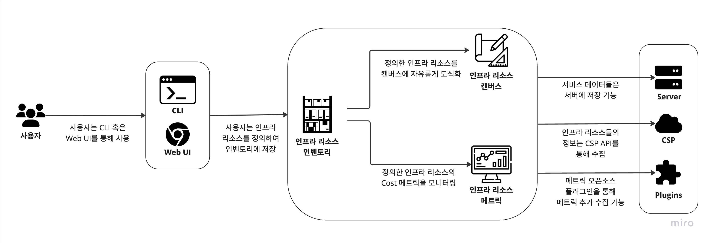

# aerosquirrel

인프라 리소스 인벤토리, 아키텍처 다이어그램, 리소스 메트릭을 제공하는 인프라 리소스 매니저 
(Infra Resource Manager with Resource Inventory, Architecture Diagram, and Resource Metric)

## 개요

AeroSquirrel은 인프라를 한 눈에 볼 수 있도록, 인프라 리소스를 한 곳에 저장하고, 이를 캔버스에 자 유롭게 도식화하여 볼 수 있으며,
리소스들의 정보, 특히 비용과 같은 메트릭을 한 눈에 볼 수 있게 도와주어 흩어져 있는 인프라 정보들의 접근성을 높여주는 솔루션입니다.

### 서비스 구성도

AeroSquirrel에는 다음과 같은 핵심 기능이 포함됩니다.

- 인프라 리소스 인벤토리: 사용자는 인프라 리소스를 정의하여 인벤토리에 저장할 수 있습니다.
- 인프라 리소스 캔버스: 사용자는 정의한 인프라 리소스를 캔버스에 아키텍처를 그리듯 자유롭게 도 식화할 수 있습니다.
- 인프라 리소스 메트릭: 사용자는 정의한 인프라 리소스의 메트릭, 특히 cost 메트릭을 한눈에 볼 수 있습니다.

TDB: 추가로 AeroSquirrel에는 다음과 같은 요소들이 통합될 수 있습니다.
- 서버: 서비스 데이터들을 서버에 저장하여, 여러 클라이언트에서 서비스를 이용할 수 있습니다.
- CSP: 인프라 리소스들의 정보는 CSP API를 통해 수집할 수 있습니다.
- Plugins: 메트릭 오픈 소스들과의 연계로 메트릭을 추가 수집할 수 있습니다.

## 문서

- [개발 배경 및 목표](https://github.com/oidc-soma/aerosquirrel/wiki/%EA%B0%9C%EB%B0%9C-%EB%B0%B0%EA%B2%BD-%EB%B0%8F-%EB%AA%A9%ED%91%9C)
- [개발 가이드](https://github.com/oidc-soma/aerosquirrel/wiki/%EA%B0%9C%EB%B0%9C-%EA%B0%80%EC%9D%B4%EB%93%9C)
- [API 가이드](https://github.com/oidc-soma/aerosquirrel/wiki/API-%EA%B0%80%EC%9D%B4%EB%93%9C)

## 기여 가이드

[CONTRIBUTING.md](./CONTRIBUTING.md)를 참고해주세요.
